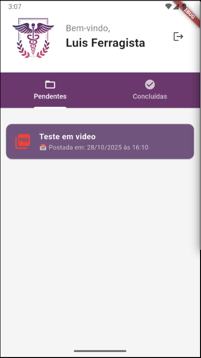
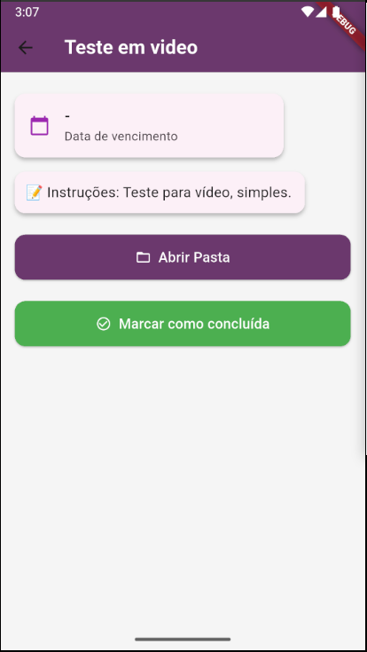
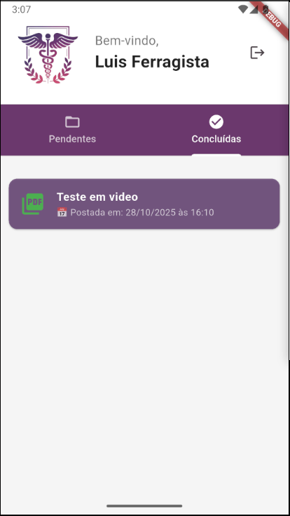

# PlenusApp

**PlenusApp** é um aplicativo multiplataforma desenvolvido em **Flutter**, com foco principal em **Android**, mas também compatível com **Web, Windows, Linux e iOS**. Ele permite aos clientes de empresas de contabilidade acessar e gerenciar suas guias de pagamento e documentos fiscais de forma simples e segura.

O app consome dados fornecidos pelo [PlenusDesk](https://github.com/Nathan-Dev-udia/PlenusDesk), a plataforma web administrativa, garantindo que apenas usuários cadastrados pelo administrador possam acessar suas informações.
Ele se conecta ao **Firebase Realtime Database** e utiliza o **Firebase Authentication** para autenticação, exibindo os arquivos armazenados em pastas no **Google Drive** associadas a cada cliente.

---
> ⚠️ **Aviso:**
>
> O repositório disponibiliza o código do PlenusApp, mas a integração com **Firebase** e **Google Drive** foi removida por questões de segurança. Quem clonar o projeto não terá acesso a essa funcionalidade.
>

---

## ⚡ Funcionalidades Principais

### 🔹 Login
- Autenticação via **Firebase Authentication** para usuários **pré-cadastrados no [PlenusDesk](https://github.com/Nathan-Dev-udia/PlenusDesk)**;  
- Feedback de sucesso ou erro no login;  
- Interface responsiva e baseada no Material Design 3.

### 🔹 Listagem de Guias
- Visualização de guias **pendentes** e **concluídas** em abas separadas;  
- Ordenação das guias por **data de postagem**;  
- Indicadores visuais de status (pendente/concluída);
- Mensagem de boas vinda ao usuário logado.

### 🔹 Detalhes da Guia
- Ao clicar em uma guia, o usuário acessa a **tela de detalhes**:
  - Data de vencimento quando houver;  
  - Instruções ou descrição da guia;
  - Botão para abrir a **pasta no Google Drive** contendo os arquivos;  
  - Botão para marcar/desmarcar a guia como concluída.
  

### 🔹 Sincronização em Tempo Real
- Todos os dados (guias, status, instruções) são **sincronizados imediatamente** com o Firebase;  
- Atualização de status refletida instantaneamente no app e no painel administrativo.

**🎬 Veja o fluxo completo em vídeo:** [YouTube](https://youtu.be/OUaO2QWiLJU)  
O vídeo mostra desde o cadastro de clientes e guias no [PlenusDesk](https://github.com/Nathan-Dev-udia/PlenusDesk) até a utilização do PlenusApp, incluindo a sincronização em tempo real e o uso das principais funcionalidades do app.

---

## 📱 Fluxo de Uso do Cliente

1. Cliente abre o **PlenusApp**;  
2. Realiza login com e-mail e senha;  
3. Lista de guias pendentes e concluídas é carregada do Firebase;  
4. Cliente seleciona uma guia para ver detalhes;  
5. Na tela de detalhes, pode:
   - Visualizar a data de vencimento e instruções;  
   - Abrir a pasta no Google Drive;  
   - Marcar como concluída;  
6. O status é atualizado no Firebase em tempo real.

**🎬 Veja o vídeo do PlenusApp funcionando:** [YouTube](https://youtu.be/4oot05qes-M)

---

## 🧩 Tecnologias Utilizadas

| Camada | Tecnologia |
| :--- | :--- |
| **Mobile App** | Flutter |
| **Banco de Dados** | Firebase Realtime Database |
| **Autenticação** | Firebase Authentication |
| **Armazenamento de Arquivos** | Google Drive API |

---

## 🎨 Interface do Usuário

- **LoginPage:** Tela de login com campos de e-mail e senha;  
- **HomePage:** Exibe abas de guias pendentes e concluídas, com cards estilizados;  
- **GuiaPage:** Detalhes da guia, data de vencimento, instruções e botões de ação (abrir Drive, concluir guia);  
- Design responsivo, com cores consistentes e gradientes suaves.

---

## 🛠️ Funcionalidades Técnicas Extras

- **RouteObserver** global para controle de navegação e status bar;  
- Tratamento de exceções em login e abertura de links;  
- Ordenação automática de guias por data de postagem;  
- Feedback visual com SnackBars em todas as ações do usuário.

---

## 🚀 Aprendizados e Decisões Técnicas

- Primeiro aplicativo **Flutter** desenvolvido para uso empresarial real;  
- Integração prática com **Firebase Authentication** e **Realtime Database**;  
- Aprendizado na manipulação de links externos (**URL Launcher**) e sincronização em tempo real;  
- Estrutura de código modular e escalável, permitindo fácil manutenção e expansão;  
- Design de UX voltado para simplicidade e clareza na experiência do cliente.

---

> 🔗 **Observação:** O PlenusApp funciona integrado ao [PlenusDesk](https://github.com/Nathan-Dev-udia/PlenusDesk), a plataforma web administrativa onde os clientes são cadastrados e as guias são gerenciadas. Para conhecer a experiência completa de gestão de guias e documentos fiscais, confira o repositório do PlenusDesk!

---
## 🧑‍💻 Autor

**Nathan Fernandes Alves**
Desenvolvedor FullStack • Foco em sistemas integrados e soluções automatizadas  

| Contato | Link |
| :-- | :-- |
| 📧 **E-mail Profissional** | [nathan.dev.udia@gmail.com](mailto:nathan.dev.udia@gmail.com) |
| 🌐 **LinkedIn** | [linkedin.com/in/nathan-fernandes-alves](https://www.linkedin.com/in/nathan-fernandes-93761a179/) |
| 💼 **Porfólio** | [https://github.com/nathan-fernandes-alves](https://nathan-dev-udia.github.io/portfolio/) |
